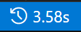

# Execution Timer



Execution Timer is a VS Code extension that tracks debug-session runtime in the status bar without showing pop-ups.

## Features

- Starts automatically when a debug session begins.
- Displays elapsed time with two decimal places.
- Excludes time spent paused at breakpoints.
- Follows the active session when multiple debug sessions are running.
- Keeps the final elapsed time visible after debugging ends.
- Resets the active timer when you click the status bar item or run **Execution Timer: Reset Timer**.

## Usage

1. Start debugging with `F5`.
2. Read the elapsed time from the status bar.
3. Pause or continue debugging as usual; paused time is not counted.
4. Click the timer to reset it to zero. If no session is running, clicking it returns the display to **Waiting**.

## Development

Development requires Node.js 22.13 or newer.

```text
npm install
npm run check
```

Press `F5` in this repository to launch an Extension Development Host. Run `npm run package` to create a VSIX package.

## Release Notes

See [CHANGELOG.md](CHANGELOG.md).

**Author:** yyhaos<br>
**License:** [WTFPL](LICENSE)
