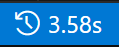

# Execution Timer - A VS Code Extension

**Run Timer** is a VS Code extension that tracks and displays the runtime of your program in the status bar. It helps developers monitor the time taken by their program execution and debugging sessions in a non-intrusive way.

## Features

- **Track Execution Time**: Displays the runtime of your program in seconds, with two decimal precision, directly in the status bar.
- **No Pop-ups**: All interactions are visible directly in the status bar without any intrusive pop-ups.

## How It Works

- **Start Timing**: When you start debugging (`F5`), the timer will automatically start.
- **End Timing**: Once the debugging session ends, the total runtime is displayed in the status bar.

## Installation

1. Open VS Code.
2. Go to the Extensions view (`Ctrl+Shift+X`).
3. Search for "Execution Timer".
4. Click **Install**.

## Usage

1. Start debugging (`F5`).
2. The timer will appear in the bottom status bar, tracking the execution time in seconds.

## Release Notes

### 1.0.0

- Initial release of Execution Timer.

---

**Author**: yyhaos  
**License**: [WTFPL License](LICENSE)
